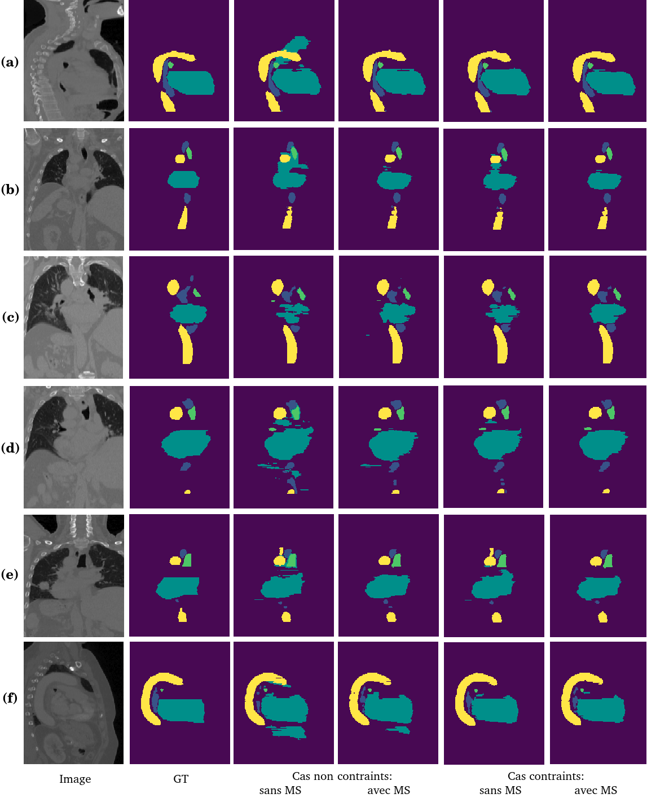

# Geometrically Constrained Neural Network

Author : [Zoé Lambert](https://zoe-lambert.fr/)

This repository contains the implementation developed to reproduce the results presented in the following two articles, along with their abstracts.

## [Enforcing Geometrical Priors in Deep Networks for Semantic Segmentation Applied to Radiotherapy Planning](https://link.springer.com/article/10.1007/s10851-022-01102-1)

### Abstract

Incorporating prior knowledge into a segmentation process, such as geometrical constraints (e.g., volume penalization, convexity enforcement) or topological prescriptions to maintain contextual object relations, has shown to enhance accuracy in medical image segmentation. This improvement is particularly notable when addressing challenges like weak boundary definition. Motivated by this, our work introduces a unified variational framework that integrates geometrical constraints into the training of convolutional neural networks via penalty terms in the loss function. These constraints include aligning level curves through weighted total variation integration, imposing area penalization as a hard constraint, and enforcing intensity homogeneity using a combination of the standard Dice loss and the piecewise constant Mumford–Shah model. The resulting mathematical formulation presents a non-smooth, non-convex optimization problem, which necessitates a Lagrangian approach due to the limitations of conventional smooth optimization techniques. Our method is applied to organ-at-risk segmentation in CT (Computed Tomography) images within the context of radiotherapy planning. Experimental results demonstrate significant improvements over existing non-constrained approaches, both quantitatively (e.g., overlap measures) and qualitatively (e.g., spatial regularity/coherence, reduced outliers), surpassing in-layer constrained deep convolutional networks while exhibiting a degree of versatility.


## [A Geometrically-Constrained Deep Network For CT Image Segmentation](https://ieeexplore.ieee.org/abstract/document/9434088)

### Abstract

Incorporating prior knowledge into a segmentation process, such as geometrical constraints (e.g., volume penalization, convexity enforcement) or topological prescriptions to maintain contextual object relations, has shown to enhance accuracy in medical image segmentation. This improvement is particularly notable when addressing challenges like weak boundary definition. Motivated by this, our work aims to incorporate geometrical constraints into the training of convolutional neural networks via penalty terms in the loss function. These constraints include aligning level curves through the weighted total variation component, imposing area penalization as a hard constraint, and enforcing intensity homogeneity using a combination of the standard Dice loss and the piecewise constant Mumford-Shah model. The resulting mathematical formulation presents a non-smooth, non-convex optimization problem, which necessitates a Lagrangian approach due to the limitations of conventional smooth optimization techniques. Our method is applied to organ-at-risk segmentation in CT (Computed Tomography) images within the context of radiotherapy planning. Experimental results demonstrate significant improvements over existing non-constrained approaches.

## Result



## How to Use

After cloning the project, follow these steps:

1. Create a virtual environment and install the necessary libraries:
    ```bash
    make venv
    ```

2. Navigate to the file `src/geometrically_constrained/conf/conf_file.py` and modify the desired parameters, particularly:
   - `data_dir`: the path to the folder containing the training and validation subfolders.
   - `train_dir`: the name of the folder containing the training data.
   - `validation_dir`: the name of the folder containing the validation data.
   - `checkpoint_dir`: the name of the folder containing the trained model checkpoints.

3. Start the training 
    ```bash
    make train
    ```
